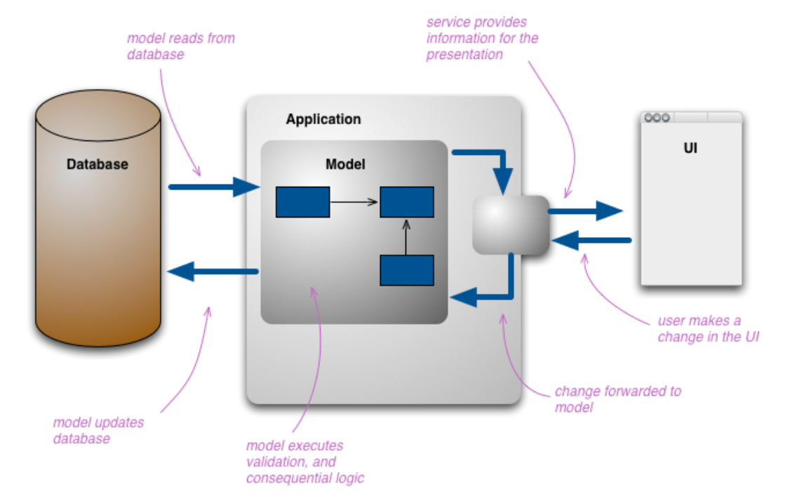
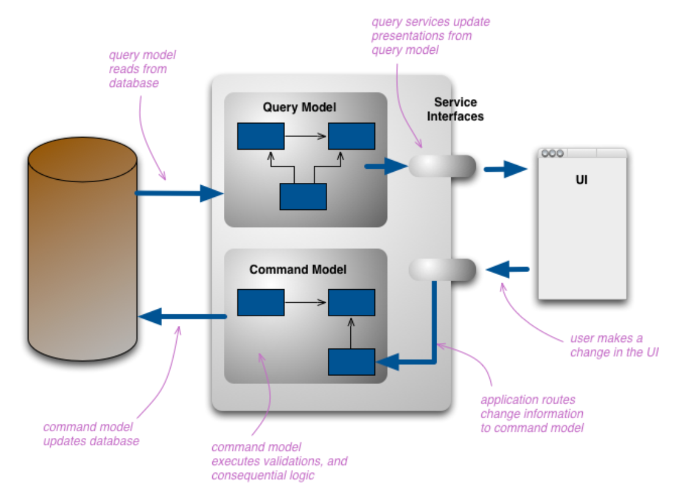

参考资料:
- [CQRS](https://martinfowler.com/bliki/CQRS.html)

## 背景
CQRS 代表 **Command Query Responsibility Segregation**，命令与查询职责分离。

最原始的 CRUD 案例一定是仅包含数据库访问功能的应用程序:

随着需求的不断增长，想要以更加个性化的方式从系统中「读取」数据，例如将多条记录合并成一条，从多张数据表中组成新的虚拟表。在「更新」方面，我们想要在持久化之前添加验证规则或从现有数据计算出合理的值。我们会发现越来越多信息的组合才是对应用程序有价值的数据，开发人员通过会在域模型之上建立概念模型以供消费方使用。

引入 CQRS 旨在将用于展示和修改系统状态的模型从概念模型中分离，在概念模型中同时包含两者将引入对两者都没有好处的复杂度。下图展示了一个 CQRS 应用程序模型:

内存对象可能使用相同的数据库，也可能使用不同的数据库。使用单独的数据库意味着需要某种通信机制来同步数据。

在决定采用 CQRS 之前仍需思考再三，因为它会给项目引入复杂度，更高的复杂度意味着更高的风险。CRUD 仍然是许多系统最适合最简单的模型。CQRS 主要运用在复杂度较高的域模型设计和对性能要求较高的系统中。