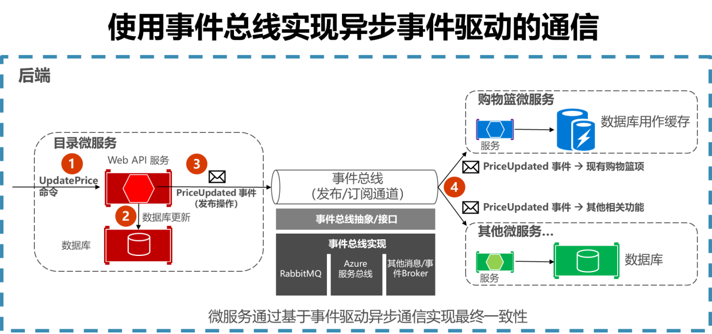
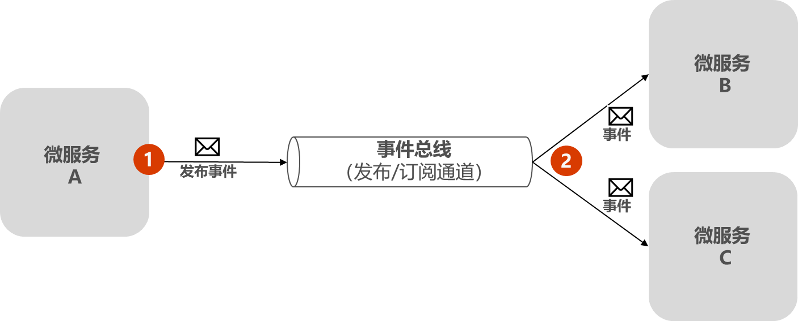
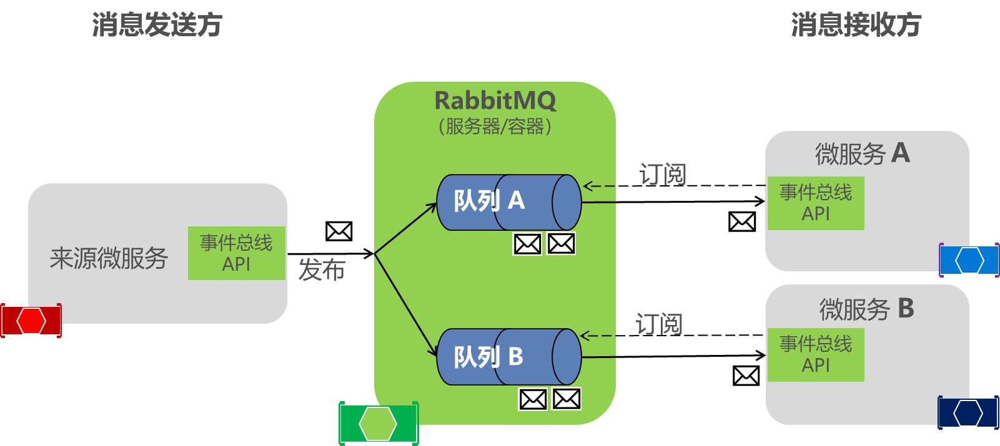
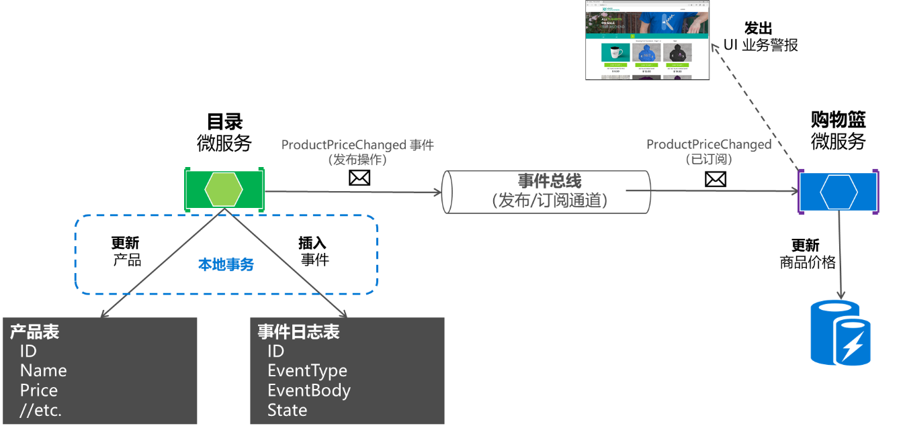
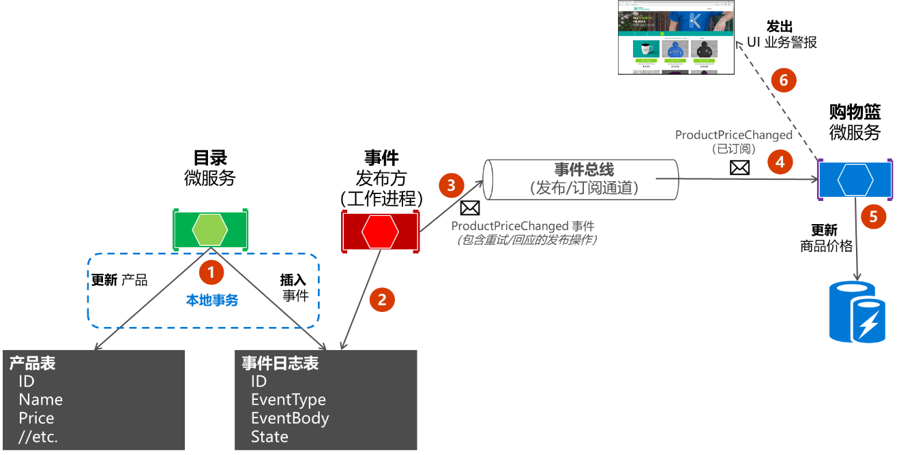

本文索引:
- [问题场景](#%E9%97%AE%E9%A2%98%E5%9C%BA%E6%99%AF)
- [在微服务(集成事件)之间实现基于事件的通信](#%E5%9C%A8%E5%BE%AE%E6%9C%8D%E5%8A%A1%E9%9B%86%E6%88%90%E4%BA%8B%E4%BB%B6%E4%B9%8B%E9%97%B4%E5%AE%9E%E7%8E%B0%E5%9F%BA%E4%BA%8E%E4%BA%8B%E4%BB%B6%E7%9A%84%E9%80%9A%E4%BF%A1)
- [实现机制](#%E5%AE%9E%E7%8E%B0%E6%9C%BA%E5%88%B6)
- [定义集成事件](#%E5%AE%9A%E4%B9%89%E9%9B%86%E6%88%90%E4%BA%8B%E4%BB%B6)
- [事件总线](#%E4%BA%8B%E4%BB%B6%E6%80%BB%E7%BA%BF)
  - [定义事件总线接口](#%E5%AE%9A%E4%B9%89%E4%BA%8B%E4%BB%B6%E6%80%BB%E7%BA%BF%E6%8E%A5%E5%8F%A3)
- [订阅事件](#%E8%AE%A2%E9%98%85%E4%BA%8B%E4%BB%B6)
- [发布事件](#%E5%8F%91%E5%B8%83%E4%BA%8B%E4%BB%B6)
  - [在发布到事件总线时设计原子性和弹性](#%E5%9C%A8%E5%8F%91%E5%B8%83%E5%88%B0%E4%BA%8B%E4%BB%B6%E6%80%BB%E7%BA%BF%E6%97%B6%E8%AE%BE%E8%AE%A1%E5%8E%9F%E5%AD%90%E6%80%A7%E5%92%8C%E5%BC%B9%E6%80%A7)
  - [持久化集成事件](#%E6%8C%81%E4%B9%85%E5%8C%96%E9%9B%86%E6%88%90%E4%BA%8B%E4%BB%B6)
- [消息事件中的幂等性](#%E6%B6%88%E6%81%AF%E4%BA%8B%E4%BB%B6%E4%B8%AD%E7%9A%84%E5%B9%82%E7%AD%89%E6%80%A7)

## 问题场景
正如[实施微服务架构所面临的挑战](/architecture-microservice-challenges)所提到的，如何保证跨多个服务间的一致性，是一个显著的挑战。

## 在微服务(集成事件)之间实现基于事件的通信
使用事件通信来实现跨多个服务的业务，借此在服务间保持最终一致性。最终一致性的事务由一系列分布式操作组成。在每个操作中，微服务更新业务实体并发布一个事件来触发下一个操作。同样以 `eShopOnContainers` 为例，下图展现了基于事件的异步通信过程:


## 实现机制
`eShopOnContainers` 示例中展示的示例事件总线抽象和实现仅用作概念证明。一旦决定要进行异步和事件驱动的通信，应该选择最符合生产环境需求的服务总线产品。
- EventBroker(消息代理): RabbitMQ、Azure 服务总线灯
- ServiceBus(服务总线): [NServiceBus](https://github.com/Particular/NServiceBus)、[MassTransit](https://github.com/MassTransit/MassTransit) 或 [Brighter](https://github.com/BrighterCommand/Brighter) 在 RabbitMQ 和 Azure 服务总线之上运行。

通过在微服务之外发布「集成事件」来同步领域状态。当集成事件发布到多个「接收微服务」时，每个接收微服务中定义的相应处理程序将处理该事件。

## 定义集成事件
`eShopOnContainers` 在 `BuildingBlocks` 中的 `EventBus` 项目定义了事件总线所有通用的类型，`Events` 目录下定义了 `IntegrationEvent` 类型:
```csharp
    public class IntegrationEvent
    {
        public IntegrationEvent()
        {
            Id = Guid.NewGuid();
            CreationDate = DateTime.UtcNow;
        }

        [JsonConstructor]
        public IntegrationEvent(Guid id, DateTime createDate)
        {
            Id = id;
            CreationDate = createDate;
        }

        [JsonProperty]
        public Guid Id { get; private set; }

        [JsonProperty]
        public DateTime CreationDate { get; private set; }
    }
```
具体的集成事件在每个微服务的应用程序级定义，因为它们与其他微服务是解耦的。方式与服务器和客户端中的 `ViewModel` 的定义相当。不建议在多个微服务间共享一个通用的集成事件库，原因与不建议在多个微服务中共享通用的领域模型相同：微服务必须完全自治。

## 事件总线
事件总线可以让微服务之间进行发布/订阅式通信，而不需要组件明确了解彼此。



如何实现发布者和订阅者之间的匿名性？一个简单的方法是让中间人负责所有沟通。事件总线就是这样的中间人。事件总线通常由两部分组成: 
- 抽象或接口
- 一种或多种实现

> 只有当需要基本事件总线功能时，才使用自己的抽象(事件总线接口)。如果需要更丰富的服务总线功能，则应该使用商用服务总线提供的 API 和抽象，而非自己的抽象。

### 定义事件总线接口
`EventBus` 项目下的 `Abstraction` 目录定义了 `IEventBus` 接口:
```csharp
    public interface IEventBus
    {
        void Publish(IntegrationEvent @event);

        void Subscribe<T, TH>()
            where T : IntegrationEvent
            where TH : IIntegrationEventHandler<T>;

        void SubscribeDynamic<TH>(string eventName)
            where TH : IDynamicIntegrationEventHandler;

        void UnsubscribeDynamic<TH>(string eventName)
            where TH : IDynamicIntegrationEventHandler;

        void Unsubscribe<T, TH>()
            where TH : IIntegrationEventHandler<T>
            where T : IntegrationEvent;
    }
```
- `Publish` 方法: 事件总线将集成事件广播给订阅了该事件的任何微服务，甚至是外部应用程序。该方法由发布事件的微服务使用。
- `Subscribe` 方法（取决于不同参数，可以使用多个实现）由想要接收事件的微服务使用。这个方法有两个参数:
  - 第一个是要订阅的集成事件(IntegrationEvent)
  - 第二个参数是集成事件处理程序(或回调方法)，类型为 `IIntegrationEventHandler<T>`，当接收方微服务获取该集成事件消息时执行。

eShopOnContainers 中的一个自定义事件总线的实现基本上是使用 RabbitMQ API 库获得的(还有另一个基于 Azure 服务总线的实现)。该事件总线的实现使微服务能够订阅事件，发布事件并接收事件:


`EventBusRabbitMQ` 类型实现了 `IEventBus` 接口:
```csharp
public class EventBusRabbitMQ : IEventBus, IDisposable 
{ 
   // Implementation using RabbitMQ API 
   //... 
}
```
「发布微服务」和「订阅微服务」通过 DI 的方式在运行时将该实现类作为 `IEventBus` 的实现，以发布或订阅集成事件。

## 订阅事件
使用事件总线的第一步是使微服务订阅想要接收的事件。下列代码显示了启动服务时(即在 Startup 类中)，为订阅所需事件而将特定的事件处理程序进行注册，这将发生在每个对这些事件感兴趣的「接收微服务」中。本例中 `basket.api` 微服务需要订阅 `ProductPriceChangedIntegrationEvent` 和 `OrderStartedIntegrationEvent` 消息:
```csharp
var eventBus = app.ApplicationServices.GetRequiredService<IEventBus>(); 

eventBus.Subscribe<ProductPriceChangedIntegrationEvent, ProductPriceChangedIntegrationEventHandler>(); 
eventBus.Subscribe<OrderStartedIntegrationEvent, OrderStartedIntegrationEventHandler>();
```
上述代码运行后，「接收微服务」将通过 RabbitMQ 通道监听。当任何类型为 `ProductPriceChangedIntegrationEvent` 的消息到达后，将调用对应的事件处理程序并处理事件。 

## 发布事件
之后，「发布微服务」使用类似下列的代码发布集成事件。(这是一个不考虑原子性的简化示例。)每当事件必须跨多个微服务传播时，通常在从原始微服务提交数据或事务之后，就需要实现类似的代码。 
首先，事件总线实现对象将被注入控制器构造函数，如下代码所示:
```csharp
[Route("api/v1/[controller]")]  
public class CatalogController : ControllerBase 
{ 
    private readonly CatalogContext _context;
    private readonly IOptionsSnapshot<Settings> _settings;
    private readonly IEventBus _eventBus;
 
    public CatalogController(CatalogContext context,
                             IOptionsSnapshot<Settings> settings,
                             IEventBus eventBus)
    {
        _context = context;
        _settings = settings;
        _eventBus = eventBus;
        // ...      
    }
}
```
随后从控制器中的方法中使用，如 `UpdateProduct` 方法:
```csharp
[Route("update")] [HttpPost]  
public async Task<IActionResult> UpdateProduct([FromBody]CatalogItem product)  
{ 
    var item = await _context.CatalogItems.SingleOrDefaultAsync(i => i.Id == product.Id);
    // ...      
    if (item.Price != product.Price)
    {
        var oldPrice = item.Price;
        item.Price = product.Price;  
        _context.CatalogItems.Update(item);

        var @event = new ProductPriceChangedIntegrationEvent(item.Id, item.Price, oldPrice);
        // Commit changes in original transaction
        await _context.SaveChangesAsync();
       // Publish integration event to the event bus
       _eventBus.Publish(@event);
       // ...
    }
}
```

### 在发布到事件总线时设计原子性和弹性
考虑上述代码的关键部分:
```csharp
var @event = new ProductPriceChangedIntegrationEvent(item.Id, item.Price, oldPrice);
// Commit changes in original transaction
await _context.SaveChangesAsync();
// Publish integration event to the event bus
_eventBus.Publish(@event);
```
如果服务在数据库更新之后崩溃，即崩溃发生在 `await _context.SaveChangesAsync()` 之后但在 `_eventBus.Publish(@event)` 之前。那么将导致领域状态已更新，但集成事件没有发布成功，整个系统状态可能会变得不一致。在探讨解决方案之前，首先了解:
- 强一致性: 即事务一致性，将多个操作放到单一事务处理，要么全部成功，要么全部失败。
  {asset_img }
- 最终一致性: 通过将某些操作的执行延迟到稍后的时间来执行。若前面的操作执行成功，后续操作将延后执行，若前面的操作失败，后续的操作就不会执行。

如果从微服务的角度看，每个微服务负责各自的业务逻辑，对于目录微服务来说，它的关注点是产品的更新是否成功。至于借助事件总线通过异步事件实现微服务间的通信，并不是其关注点。换句话说，产品的更新不应该依赖外部状态，在这里，外部状态就是事件总线的可用性。如果事件总线挂了，事件消息不能丢失，只要事件消息不丢，就还有机会挽救(重新发布消息)。

### 持久化集成事件
eShopOnContainers 提到了以下 3 种模式以解决该问题的模式:
- 使用完整的[事件溯源模式](https://docs.microsoft.com/en-us/previous-versions/msp-n-p/dn589792(v=pandp.10))
- 使用[事务日志挖掘](https://www.scoop.it/t/sql-server-transaction-log-mining)
- 使用[发件箱模式](http://gistlabs.com/2014/05/the-outbox/)。这是一个用于存储集成事件的事务表。

要保证事件消息不丢失，我们会第一时间想到持久化，`eShopOnContainers` 包含了一个名为 `IntegrationEventLogEF` 的项目，该项目定义了一系列用于持久化集成事件的通用类型，例如 `IntegrationEventLogEntry` 表示集成事件数据模型:
```csharp
    public class IntegrationEventLogEntry
    {
        private IntegrationEventLogEntry() { }
        public IntegrationEventLogEntry(IntegrationEvent @event)
        {
            EventId = @event.Id;            
            CreationTime = @event.CreationDate;
            EventTypeName = @event.GetType().FullName;
            Content = JsonConvert.SerializeObject(@event);
            State = EventStateEnum.NotPublished;
            TimesSent = 0;
        }
        public Guid EventId { get; private set; }
        public string EventTypeName { get; private set; }
        [NotMapped]
        public string EventTypeShortName => EventTypeName.Split('.')?.Last();
        [NotMapped]
        public IntegrationEvent IntegrationEvent { get; private set; }
        public EventStateEnum State { get; set; }
        public int TimesSent { get; set; }
        public DateTime CreationTime { get; private set; }
        public string Content { get; private set; }

        public IntegrationEventLogEntry DeserializeJsonContent(Type type)
        {
            IntegrationEvent = JsonConvert.DeserializeObject(Content, type) as IntegrationEvent;
            return this;
        }
    }

```
任何需要保证原子性的微服务都需要在本地持久化集成事件，并将更新领域状态与发布集成事件包含在同一个本地事务中。于是，新的步骤将演变为:
1. 应用程序开始本地数据库事务
2. 更新领域实体状态
3. 将事件插入集成事件表
4. 提交事务

这样，在持久化层面保证了所需的原子性，但实施发布事件的步骤有以下两种选择:
- 在提交事务后立即发布集成事件，并将其标记为已发布。当微服务发生故障时，可以通过遍历存储的集成事件(未发布)执行补救措施
  
- 将事件日志表用作一种队列。使用单独的线程或进程查询事件日志表，将事件发布到事件总线，然后将事件标记为已发布
  

第二种方式显然更为妥当，但为了简单起见，`eShopOnContainers` 实现了第一种方式。

## 消息事件中的幂等性
幂等性意味着可以多次执行操作而不改变结果。在消息传递环境中传播事件时，如果可以多次传送事件而不改变「接收微服务」的结果，则事件是幂等的。在消息通信中我们需要确保操作是幂等的，或者能提供足够的信息，以确保可以检测到重复并丢弃，仅发送一个响应。

幂等消息可通过设计获得。例如，可以创建一个表示「将产品价格设置为 $25」而不是「将产品价格增加 $5」的事件。此时可以安全地处理第一种消息，无论处理多少次结果都一样。但即使在第一种情况下，可能也不想重复处理第一种事件，因为系统也可能发送了较新的价格变动事件，无序处理可能会导致覆盖新的价格。

让每个事件具有某种标识是种方便的做法，我们可以创建强制每个接收者对每个事件只处理一次的逻辑。更多关于消息幂等性可参考[Journey 6: Versioning Our System](https://msdn.microsoft.com/library/jj591565.aspx)。