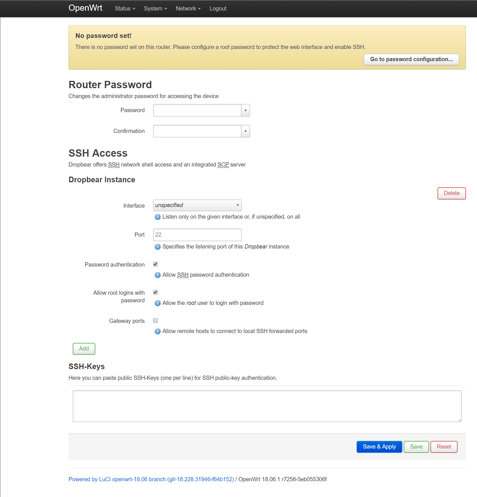
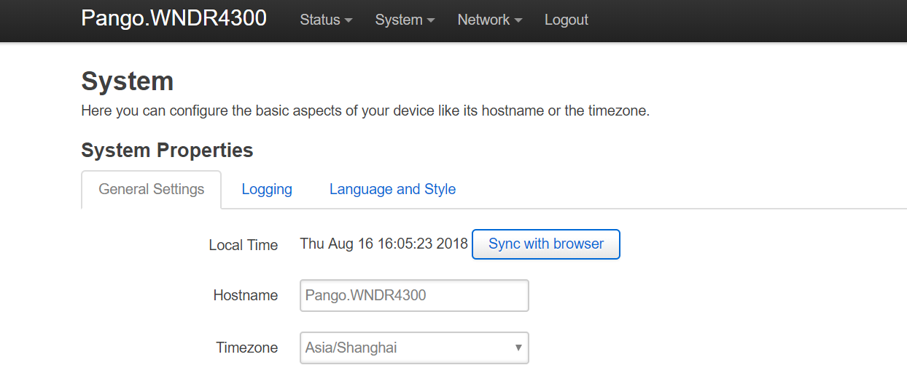
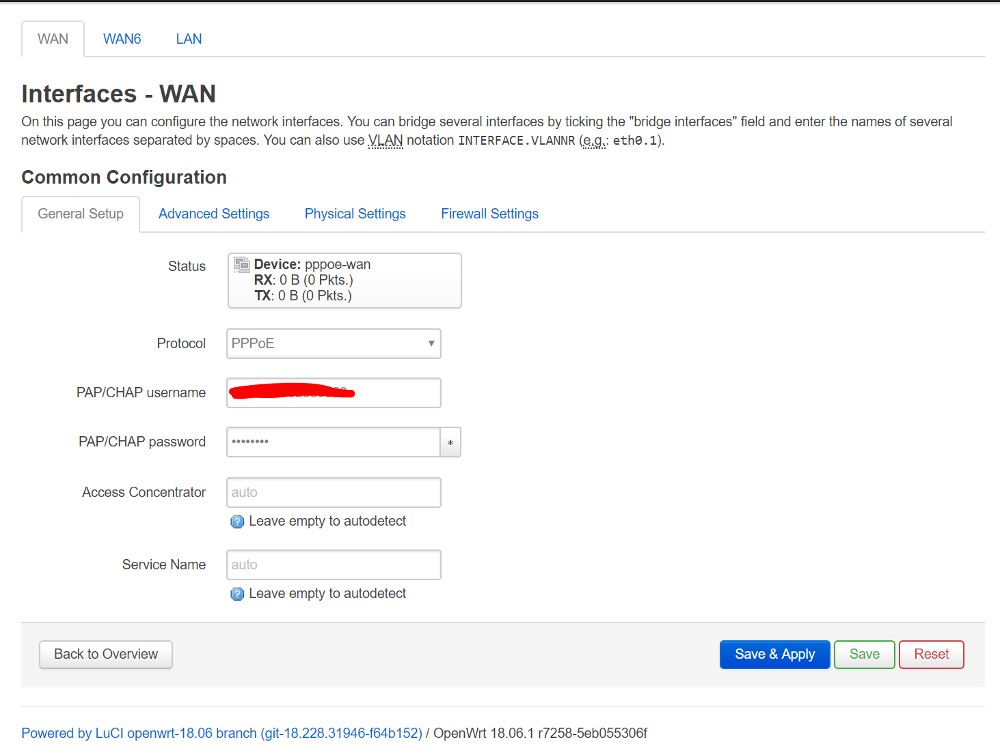

本文索引:
- [前言](#%E5%89%8D%E8%A8%80)
- [检查兼容性](#%E6%A3%80%E6%9F%A5%E5%85%BC%E5%AE%B9%E6%80%A7)
- [安装固件](#%E5%AE%89%E8%A3%85%E5%9B%BA%E4%BB%B6)
  - [通过 TFTP 的方式安装](#%E9%80%9A%E8%BF%87-tftp-%E7%9A%84%E6%96%B9%E5%BC%8F%E5%AE%89%E8%A3%85)
  - [通过网件 OEM 方式安装](#%E9%80%9A%E8%BF%87%E7%BD%91%E4%BB%B6-oem-%E6%96%B9%E5%BC%8F%E5%AE%89%E8%A3%85)
- [配置 OpenWrt](#%E9%85%8D%E7%BD%AE-openwrt)
- [安装 USB 驱动](#%E5%AE%89%E8%A3%85-usb-%E9%A9%B1%E5%8A%A8)
- [启用 SMB 服务](#%E5%90%AF%E7%94%A8-smb-%E6%9C%8D%E5%8A%A1)

## 前言
路由器是家庭网络必不可少的基础设施，而路由器运行的系统也决定了家庭网络功能的边界。OpenWrt 是一个开源的路由器项目

## 检查兼容性
1. [OpenWrt 项目官网](https://openwrt.org/)
2. 至这个[页面](https://openwrt.org/toh/start)查看支持的设备
3. 定位到对应路由器设备页面，本文以 [Netgear WNDR 4300](https://openwrt.org/toh/netgear/wndr4300) 为例，注意安装和升级是两个文件

## 安装固件
新版的镜像在 GUI 方面做了很大的改进，几乎所有设置都可以通过在 Web UI 上完成。
### 通过 TFTP 的方式安装
1. 关闭路由器电源
2. 为本机预设一个固定的 ip 地址，例如 `192.168.1.35`，用网线连接至路由器
3. 打开路由器电源
4. 当 LED 灯亮起时，按住 **RESET** 按钮
5. 保持 **RESET** 按钮按住，直至「电源 LED 灯」由闪烁「黄灯」变为闪烁「绿灯」
6. 执行 `tftp` 流转:
```bash
$ tftp -i 192.168.1.1 PUT ./openwrt-18.06.1-ar71xx-nand-wndr4300-ubi-factory.img
```
> PUT 之后的参数跟 image 的路径

### 通过网件 OEM 方式安装
1. 使用网线连接至路由器，并在浏览器中输入 http://192.168.1.1
2. 导航至 Advanced -> Administration -> Firmware Upgrade
3. 上传 OpenWrt 固件 `openwrt-18.06.1-ar71xx-nand-wndr4300-ubi-factory.img`，点击开始
4. 等待安装完成

> 安装完成之后，可能需要重启一次才能正常访问 192.168.1.1

## 配置 OpenWrt
1. 导航至 `192.168.1.1`，使用 `root`(密码为空)，登录页面，修改一个 `root` 的密码

2. 导航至 System -> System，为路由器主机换一个名字，并更改为对应的时区:

3. 将光猫用网线连接路由器的 WAN 口，导航至 Network -> Interface，编辑 WAN:
    1. 使用路由器进行拨号上网，在 Protocol 一栏选择 `PPPoE`
    2. 点击 `Switch protocol` 确认操作
    3. 填写由 ISP 分配的账号与密码:
    4. 完成之后点击 `Save & Apply`

4. 导航至 Network -> Wireless，设置 2.4 GHz 及 5 GHz 的无线网络

接下来，便可开始对路由器针对性的配置诸如 DDNS，端口转发等功能的配置了。

## 安装 USB 驱动

See [Installing and troubleshooting USB Drivers](https://openwrt.org/docs/guide-user/storage/usb-installing) and [Using storage devices](https://openwrt.org/docs/guide-user/storage/usb-drives)

## 启用 SMB 服务

See [SMB Samba share overview (aka Windows file sharing)](https://openwrt.org/docs/guide-user/services/nas/samba_configuration)