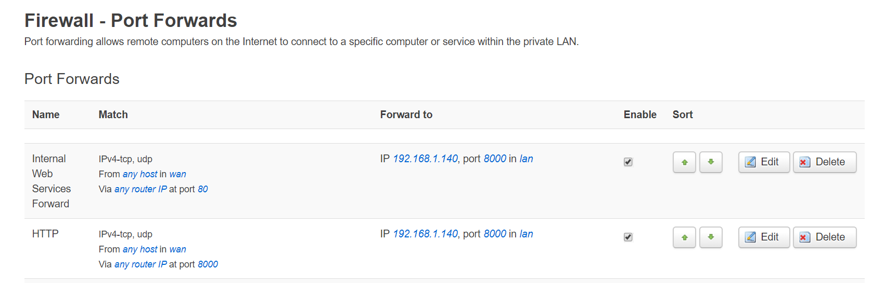

本文索引: 
- [内网穿透](#%E5%86%85%E7%BD%91%E7%A9%BF%E9%80%8F)
  - [实现原理](#%E5%AE%9E%E7%8E%B0%E5%8E%9F%E7%90%86)
  - [前提条件](#%E5%89%8D%E6%8F%90%E6%9D%A1%E4%BB%B6)
  - [实现](#%E5%AE%9E%E7%8E%B0)
  - [在路由器中配置端口转发](#%E5%9C%A8%E8%B7%AF%E7%94%B1%E5%99%A8%E4%B8%AD%E9%85%8D%E7%BD%AE%E7%AB%AF%E5%8F%A3%E8%BD%AC%E5%8F%91)

## 内网穿透
ISP 运营商会为每户家庭宽带分配一个公网 IP 地址，位于互联网上的主机通过该 IP 地址，再由路由器映射到内网某台提供服务的主机上，就实现了内网穿透。然而，由于 ISP 运营商分配到家庭宽带的公网 IP 地址是动态变化的，那么每次公网 IP 地址变化之后都需要动手更改目标 IP 地址，才能继续访问家中的服务。`DDNS(动态域名解析)` 技术解决了这个问题。
### 实现原理
通过在内网某台主机(本文以树莓派为例)上不断检测本地 WAN 的公共 IP 地址变化，并不断向指定的域名更新记录。这样，当从外网通过域名解析主机时，将始终指向同一个主机。

### 前提条件
为了实现 DDNS，至少应该准备:
1. 可远程管理的注册域名: 本文以阿里云万网域名为例
2. 路由器具备端口转发功能
3. 确保本地网络的公网 IP 可由外网访问，这一条主要是针对国内某些 ISP 将家庭宽带挂到某个大局域网下面，具体参见[电信宽带的正确使用姿势](homeserver-setup-isp-device)

### 实现
国内市场上有诸如[花生壳](https://www.oray.com/)，国外市场上有诸如 [DuckDns](https://www.duckdns.org/) 的 DDNS 服务商，他们为用户提供二级域名使用权和相应的客户端软件用以更新 DNS 记录。为了争取最大的自由度，本文将绕过第三方通过开源手段来实现。

假设我在阿里云(也可能是腾讯云，重要的是其提供相应的域名管理 API)注册了 `example.com`，阿里云负责提供全网都可访问该域名的 `dns` 服务。Git Clone 或[下载 DDNS](https://github.com/NewFuture/DDNS/archive/master.zip) 至树莓派。

```bash
$ git clone https://github.com/NewFuture/DDNS
$ cd DDNS
$ python ./run.py
```
详细使用方法参考 [DDNS Github Repo](https://github.com/NewFuture/DDNS)。

### 在路由器中配置端口转发
路由器没有能力或并不知道从外网入站的网络访问需要什么样的服务，它需要将入站请求转发至提供该种服务的内网主机，并映射相应的端口号。



> 由于众所周知的原因，国内 ISP 屏蔽了家庭网络的 80 及 443 端口，如果需要提供 http(s) 服务，需要选择其他端口。