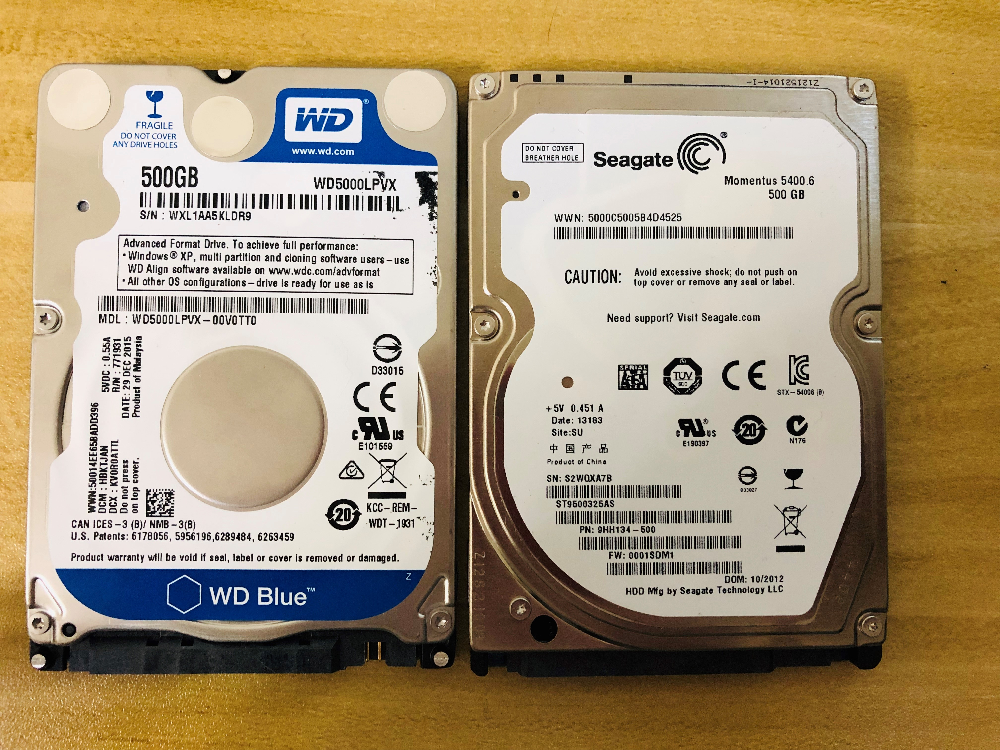
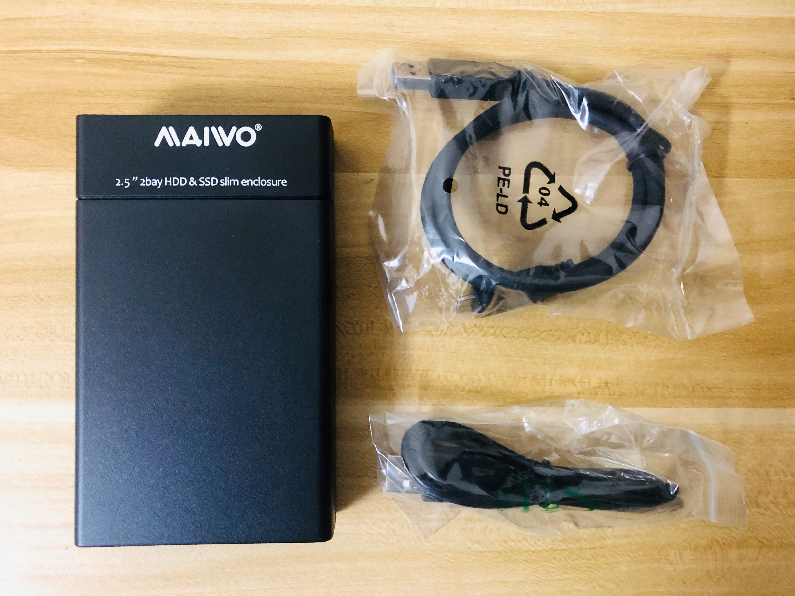
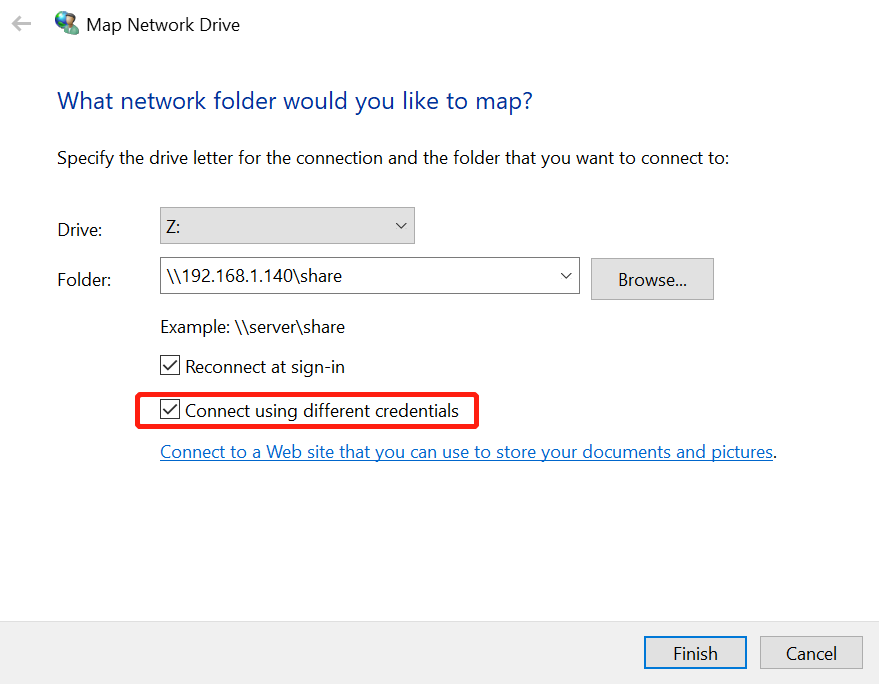
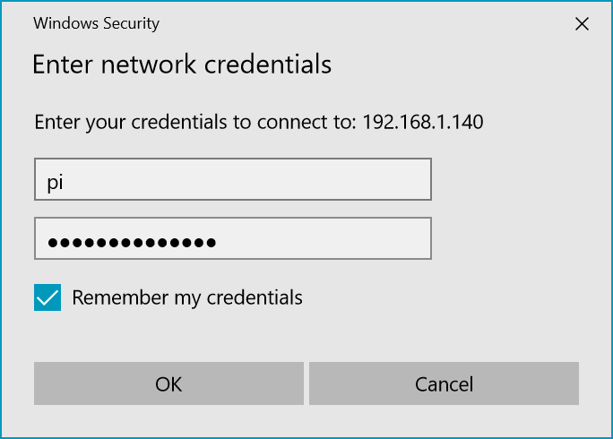

参考资料:
- [R-Pi NAS](https://elinux.org/R-Pi_NAS)
- [Emergency Mode due to fstab](https://www.raspberrypi.org/forums/viewtopic.php?p=1105501)

本文索引:
- [背景](#%E8%83%8C%E6%99%AF)
- [准备工作](#%E5%87%86%E5%A4%87%E5%B7%A5%E4%BD%9C)
  - [软件部分](#%E8%BD%AF%E4%BB%B6%E9%83%A8%E5%88%86)
  - [硬件部分](#%E7%A1%AC%E4%BB%B6%E9%83%A8%E5%88%86)
- [传统方式架设 Samba 服务](#%E4%BC%A0%E7%BB%9F%E6%96%B9%E5%BC%8F%E6%9E%B6%E8%AE%BE-samba-%E6%9C%8D%E5%8A%A1)
  - [更新本地包:](#%E6%9B%B4%E6%96%B0%E6%9C%AC%E5%9C%B0%E5%8C%85)
  - [安装 Samba 服务](#%E5%AE%89%E8%A3%85-samba-%E6%9C%8D%E5%8A%A1)
  - [备份原始 smb.conf 文件](#%E5%A4%87%E4%BB%BD%E5%8E%9F%E5%A7%8B-smbconf-%E6%96%87%E4%BB%B6)
  - [配置 smb.conf](#%E9%85%8D%E7%BD%AE-smbconf)
  - [创建用于访问 Samba 的用户](#%E5%88%9B%E5%BB%BA%E7%94%A8%E4%BA%8E%E8%AE%BF%E9%97%AE-samba-%E7%9A%84%E7%94%A8%E6%88%B7)
  - [解决 Windows 系统下无法访问 Share 目录的问题](#%E8%A7%A3%E5%86%B3-windows-%E7%B3%BB%E7%BB%9F%E4%B8%8B%E6%97%A0%E6%B3%95%E8%AE%BF%E9%97%AE-share-%E7%9B%AE%E5%BD%95%E7%9A%84%E9%97%AE%E9%A2%98)

## 背景
树莓派由于其能耗低、稳定性好的优点，非常适合跑 7*24 小时的长时服务，家庭 NAS 服务器是一个比较常见的需求，那么用树莓派来跑 NAS 服务再合适不过了。

## 准备工作
要实现家庭 NAS 服务，硬件和软件设备都需要做准备。
### 软件部分
软件部分指的是实现网络传输和共享的服务程序，可基于以下文件传输协议之一实现网络共享:
- SMB: [Server Message Block](https://zh.wikipedia.org/wiki/%E4%BC%BA%E6%9C%8D%E5%99%A8%E8%A8%8A%E6%81%AF%E5%8D%80%E5%A1%8A)
- NFS: [Network File System](https://zh.wikipedia.org/wiki/%E7%BD%91%E7%BB%9C%E6%96%87%E4%BB%B6%E7%B3%BB%E7%BB%9F)
- FTP: [File Transfer Protocol](https://zh.wikipedia.org/wiki/%E6%96%87%E4%BB%B6%E4%BC%A0%E8%BE%93%E5%8D%8F%E8%AE%AE)
- SFTP: [Secure File Transfer Protocol](https://zh.wikipedia.org/wiki/SSH%E6%96%87%E4%BB%B6%E4%BC%A0%E8%BE%93%E5%8D%8F%E8%AE%AE)

无论采用哪种协议进行文件共享，都需要有相应的软件服务的实现，本文采用实现了 SMB 协议的 `Sabma` 服务。

### 硬件部分
NAS 存储系统主要依赖于高容量的附加存储设备(即硬盘)，可以依据自己的需求投入相应的成本，或直接使用树莓派本身的 SD 卡存储。楼主使用了从旧笔记本电脑上拆机所得的两块硬盘，再买了一个硬盘阵列盒组了个 RAID 1 实现，其中涉及到的硬件有:
- 2.5 英寸 500GB HDD * 2
- 2.5 英寸双盘位磁盘阵列盒 * 1





当然，可以仅使用一块硬盘 + 外置硬盘盒实现，树莓派本身没有 SATA 口，只能通过 USB 接入外置硬盘，并且目前最新的 3b+ 型号上仍然是 USB2.0 接口。

## 传统方式架设 Samba 服务
为简单起见，以演示 `Samba` 服务搭建为目标，本文以 `home/pi/downloads` 为目标共享目录作为演示，挂载外接存储设备可参考[这里](/linux-partition/)。
### 更新本地包:
树莓派 `Raspbian` 系统的镜像已经包含了 `Samba` 的包，执行:
``` bash
$ sudo apt update
```
### 安装 Samba 服务
执行以下命令将安装 `Samba` 服务及其依赖的所有程序:
``` bash
$ sudo apt install samba samba-common-bin
```
### 备份原始 smb.conf 文件
安装完成后，使用 `root` 用户权限编辑 `/etc/samba/smb.conf` 来配置服务，但在此之前，先备份原始配置文件:
```bash
$ sudo cp /etc/samba/smb.conf /etc/samba/smb.conf.default
```
### 配置 smb.conf
使用喜欢的文件编辑器(树莓派内置了 `nano`)打开配置文件，并在文件的最下方插入以下内容:
```bash
[Share]
Comment = Pi shared folder
Path = /pi/home/downloads
Browseable = yes
Writeable = Yes
only guest = no
create mask = 0777
directory mask = 0777
Public = yes
Guest ok = yes
```
这表示可通过以 Samba 用户(见下文)或 `Guest` 身份读取、写入、或执行 `/mnt/shared` 目录下的内容，如果不想允许 `Guest` 身份访问，注释掉 `Guest ok` 一项即可。
> 关于 `smb.conf` 的更多选项可自行参考[这里](https://www.cnblogs.com/fatt/p/5856892.html)

希望在 Windows 系统的网络(`Network`)下看见树莓派主机，需要设置 `[global]` 节点下的 `wins support = yes` 

执行 `testparm` 以检查刚刚的更改没有造成错误:
```bash
$ testparm

[global]
        log file = /var/log/samba/log.%m
        max log size = 1000
        syslog = 0
        panic action = /usr/share/samba/panic-action %d
        usershare allow guests = Yes
        map to guest = Bad User
        obey pam restrictions = Yes
        pam password change = Yes
        passwd chat = *Enter\snew\s*\spassword:* %n\n *Retype\snew\s*\spassword:* %n\n *password\supdated\ssuccessfully* .
        passwd program = /usr/bin/passwd %u
        server role = standalone server
        unix password sync = Yes
        dns proxy = No
        wins support = Yes
        idmap config * : backend = tdb
        
[Share]
        comment = Pi shared folder
        path = /mnt/shared
        create mask = 0777
        directory mask = 0777
        guest ok = Yes
        read only = No
```

### 创建用于访问 Samba 的用户
多数情况下，我们不希望任何人在不认证的情况下就随意访问局域网内的 `Samba` 服务，但又不想为此创建专门的用户帐户(这将增加管理成本)，可告知 `Samba` 对已有 UNIX 用户授权并设置专属于 SMB 的密码:
```bash
$ sudo smbpasswd -a pi

New SMB password:
Retype new SMB password:
```
接下来，重启 Samba 服务:
```bash
$ sudo /etc/init.d/samba restart

or

$ sudo systemctl restart smbd.service
```
### 解决 Windows 系统下无法访问 Share 目录的问题
由于使用 `pi` 用户作为访问共享目录的凭证，但 `Windows` 系统会默认以当前登录 `Windows` 的本地帐号作为访问共享目录的用户，这会导致无法访问共享目录。为了解决这个问题，需要清除 `Windows` 记住的网络共享目录的登录凭证。
1. 查看 `Windows` 当前记住的所有网络共享主机映射，`Windows` 针对单个 host 记录一条映射:
```cmd
$ net use 

Status       Local     Remote                    Network

-------------------------------------------------------------------------------
OK                     \\192.168.1.140\Share     Microsoft Windows Network
OK                     \\raspberrypi3b\share     Microsoft Windows Network
```
2. 清除这些映射记录:
```cmd
$ net use * /d

You have these remote connections:

                    \\192.168.1.140\Share
                    \\raspberrypi3b\share
Continuing will cancel the connections.

Do you want to continue this operation? (Y/N) [N]: y
The command completed successfully.
```
3. `Win + E` 在 `Explorer` 中映射网络驱动器，并在弹出的认证对话框中输入先前创建的 `pi` 帐号及密码:

