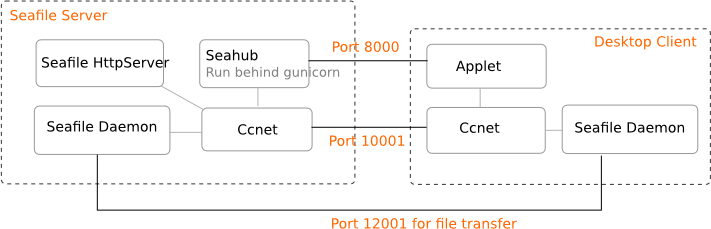
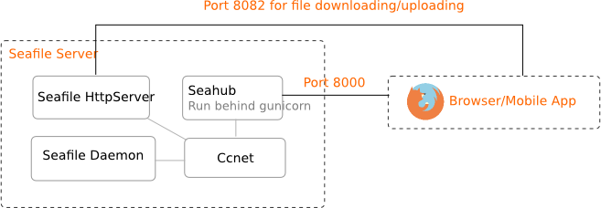
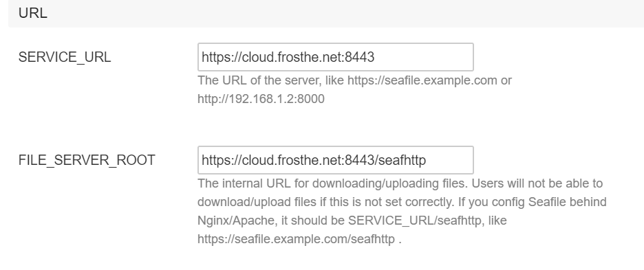
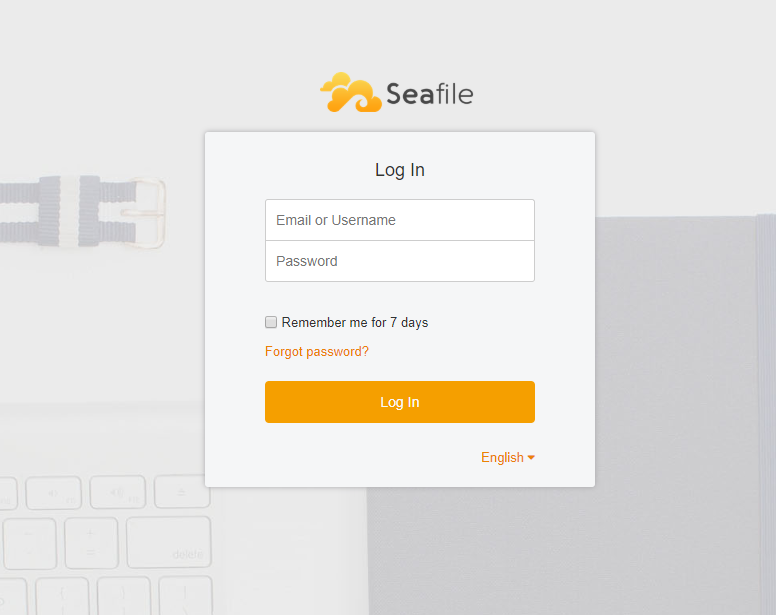
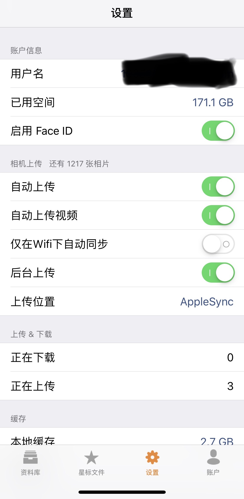

参考资料:
- [Deploying Seafile with MySQL](https://manual.seafile.com/deploy/using_mysql.html)
- [Config Seahub with Nginx](https://manual.seafile.com/deploy/deploy_with_nginx.html)
- [Enabling Https with Nginx](https://manual.seafile.com/deploy/start_seafile_at_system_bootup.html)
- [Start Seafile at System Bootup](https://manual.seafile.com/deploy/start_seafile_at_system_bootup.html)

本文索引:
- [背景](#%E8%83%8C%E6%99%AF)
- [Seafile 简介](#Seafile-%E7%AE%80%E4%BB%8B)
- [数据模型](#%E6%95%B0%E6%8D%AE%E6%A8%A1%E5%9E%8B)
- [Seafile 组成](#Seafile-%E7%BB%84%E6%88%90)
- [使用 Docker 搭建 Seafile 服务](#%E4%BD%BF%E7%94%A8-Docker-%E6%90%AD%E5%BB%BA-Seafile-%E6%9C%8D%E5%8A%A1)
- [设置开机启动 Seafile](#%E8%AE%BE%E7%BD%AE%E5%BC%80%E6%9C%BA%E5%90%AF%E5%8A%A8-Seafile)
- [使用各平台客户端](#%E4%BD%BF%E7%94%A8%E5%90%84%E5%B9%B3%E5%8F%B0%E5%AE%A2%E6%88%B7%E7%AB%AF)
- [迁移数据](#%E8%BF%81%E7%A7%BB%E6%95%B0%E6%8D%AE)

## 背景
手机和 Mac 里存的照片和视频越来越多，而 iCloud 的免费存储空间只有 5GB，更重要的是，国行 iCloud 上了云上贵州。于是萌生了在家里搭建私有云盘的想法。搭建私有云主要解决了以下几个问题:
- 突破 iCloud，百度网盘等的容量限制，自己想买多大的硬盘都可以
- 将个人数据隐私与任何第三方隔离，不用担心数据被第三方 Spy
- 提升上传下载的速度，如果用过百度网盘，都懂的。

`seafile` 是目前发现的口碑最好的开源私有云项目，完备的[官网文档](https://manual.seafile.com/)和配套的各平台的客户端，决定一试。

## Seafile 简介
`seafile` 由以下组件组成:
- `ccnet` 守护进程: `ccnet` 客户端和 `ccnet` 服务端，网络服务进程，客户端与服务端数据通信的通道
- `seafile` 守护进程: 数据服务守护进程
- `seahub`: Web UI 服务器，`seafile` 服务器包含了一个轻量的 Python Http 服务器 `gunicorn`。`seahub` 以 `gunicorn` 应用程序运行。
- `FileServer`: 由于 `gunicorn` 处理大文件非常吃力，`FileServer` 用于处理 `Seahub` 源文件上传与下载的功能。
- `Controller`: 监控 `ccnet` 与 `seafile` 守护进程，在适当的时候重启它们。

下图展示了 `seafile` 桌面客户端与服务端同步文件的过程:


下图展示了移动客户端与服务端同步文件的过程:


___
## 数据模型
`seafile` 内部使用一种类似于 `git` 的数据模型，由 `Repo`，`Branch`，`Commit`，`FS` 和 `Block` 组成。
- `Repo`: 也被称作 `Library`，每个 `repo` 都包含一个 `uuid`，以及诸如「描述」，「创建者」和「密码」等特性
- `Branch`: 与 `git` 不同，只有两种预定义的 `branch`: `local` 和 `master`。在浏览器中，针对 `Repo` 的改动会推送到服务端的临时分支，然后合并至 `master` 分支。在 PC 客户端，针对 `Repo` 的改动会:
    - 1. 首先提交到 `local` 分支
    - 2. `master` 分支从服务端下载，合并至 `local` 分支
    - 3. `local` 分支上传至服务端
    - 4. 服务端 `master` 分支以 `fast-forward` 合并至 `local` 分支。
- `Commit`: 与 Git 一致
- `FS`: 有两种类型的 FS 对象: `SeafDir Object` 和 `Seafile Object`。`SeafDir Object` 代表一个目录，`Seafile Object` 代表一个文件。
- `Block`: 一个文件被分割至数个不定长度的 `Block` 中，系统使用 [Content Defined Chunking](http://pdos.csail.mit.edu/papers/lbfs:sosp01/lbfs.pdf) 算法将文件切分至 `Block`。平均来说，一个 `Block` 大小约为 1MB。

___

## Seafile 组成
依赖于 SQLite 或 Mysql 数据库，Ccnet，Seafile 和 Seahub 均需要单独的数据库。

## 使用 Docker 搭建 Seafile 服务
`seafile docker` 针对 `x86` 和 `amd64` 架构都推出了官方的 Docker Image，网友从官方 Repo 分叉了 `arm` 架构的 [Docker Image Repo](https://github.com/domenukk/seafile-docker-pi)，确保 Docker 引擎安装好之后，执行以下命令:
```bash
docker run -d --name seafile \
-e SEAFILE_SERVER_HOSTNAME={your-domain-name} \
-e SEAFILE_ADMIN_EMAIL={your-admin-email} \
-e SEAFILE_ADMIN_PASSWORD={your-admin-password} \
-v /mnt/sda1/seafile:/shared \
-p 8000:80 \
-p 8443:443 \
seafileltd/seafile:pi
```
`--name` 的值可自行修改，它会作为 `container` 的别名，`-v` 代表映射的本地目录，此例为 `/mnt/sda1/seafile`，包括所有配置信息和数据，最好指定一个大容量硬盘的挂载目录。`SEAFILE_SERVER_HOSTNAME` 的值将直接应用到系统设置的 URL 两个参数中，如下图:



- `SERVICE_URL`: Internet 上 Seahub 的基础地址，如果是非 80，443 等默认端口号，则需要带上，例如此处的 `https://cloud.frosthe.net:8443`
- `FILE_SERVER_ROOT`: 文件服务器根地址，用于向客户端提供上传和下载文件的地址，通常为 `{SERVICE_URL}/seafhttp`，端口问题同上，`https://cloud.frosthe.net:8443/seafhttp`

> Seafile 的 Docker Image 包含了 Nginx 实例，直接由外部主机访问树莓派的 8000 或 8443 端口即可

至此，访问 `seafile` 在 LAN 下的 URL 即可开始使用:



> 通过外网访问 Seafile 的设置属于另外一个 topic，可参考 [电信宽带的正确使用姿势](/homeserver-setup-isp-device) 和 [通过 DDNS 实现稳定内网穿透](/homeserver-perform-ddns) 两篇文章

## 设置开机启动 Seafile
创建 service.unit 文件，此处以 `seafile.service` 为例:
```ini
[Unit]
Description=Seafile Service
After=mnt-sda1.mount

[Service]
Type=forking
ExecStart=/home/pi/seafile-server/seafile-server-latest/seafile.sh start
ExecStop=/home/pi/seafile-server/seafile-server-latest/seafile.sh stop
StandardOutput=inherit
StandardError=inherit
Restart=on-failure
User=pi

[Install]
WantedBy=multi-user.target
```
> 注意，因为使用到了外部存储单元，故在 `After` 一项处填写了 `mnt-sda1.mount`，意即在 sda1 挂载成功之后再启动该服务。

之后，复制该文件至 `systemd` 配置目录下:
```bash
$ sudo cp seafile.service /etc/systemd/system/seafile.service
```
使用 `systemctl start` 和 `systemctl stop` 测试服务，紧接着启用服务托管:
```bash
$ sudo systemctl enable seafile.service
```
此部分参考了[树莓派官方文档](https://www.raspberrypi.org/documentation/linux/usage/systemd.md)

## 使用各平台客户端
移步官方给出的[下载地址](https://www.seafile.com/download/)下载想要的客户端，值得一提的是，iOS 客户端可以通过设置页面同步照片:



## 迁移数据
假设先前为 `seafile` 指定的目录空间不足了，需要迁移至更多空间的目录，先停止或删除 `seafile` 的 Docker container:
```bash
$ docker stop seafile
$ docker rm seafile
```
移动原先指定的目录至新的目录:
```bash
$ rsync -avH [seafile-data-source-path] [seafile-data-destination-path]
```
数据量越大，迁移时间越长。数据迁移完成后，重新执行 `docker` 命令并指向新的映射目录即可。